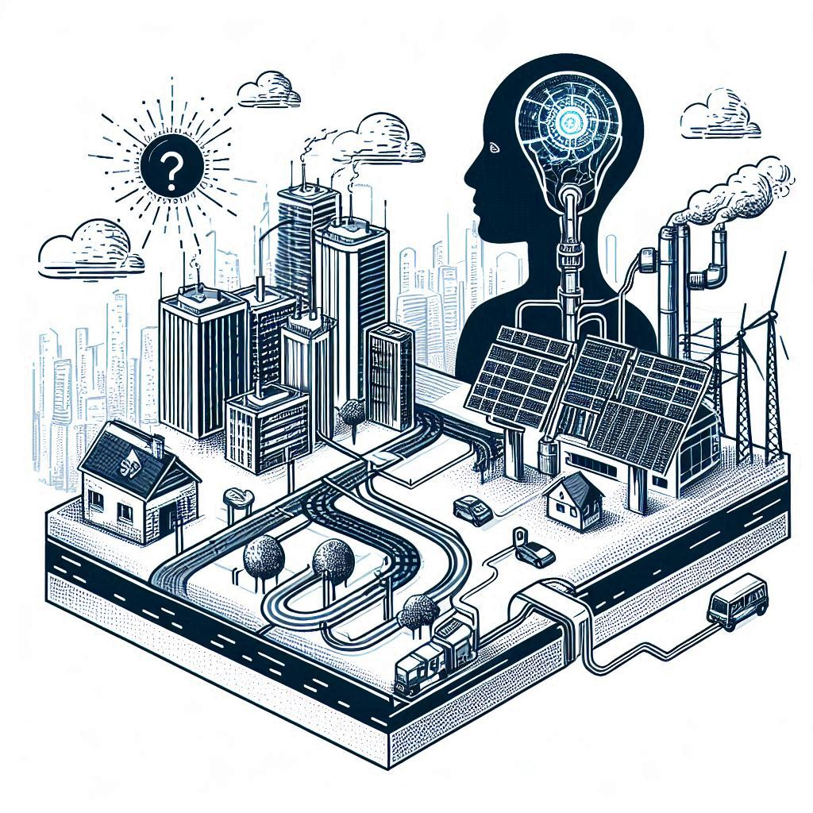

# AI-Simulation-Project-2024
# Thermoelectric Power System Simulation

## Descripción
Este proyecto consiste en la simulación de un sistema eléctrico regional basado en plantas termoeléctricas. El sistema emplea una arquitectura de agentes BDI (Belief-Desire-Intention) para la toma de decisiones, optimización de la distribución de energía, y planificación de mantenimientos. La simulación está diseñada para adaptarse a diferentes configuraciones geográficas y escenarios de demanda energética.

Los agentes simulan tanto el funcionamiento de las plantas termoeléctricas como la planificación a nivel global, con un agente principal que actúa como Jefe de la Empresa Eléctrica, encargado de optimizar la distribución de electricidad y gestionar los cortes cuando sea necesario.

## Características principales

- Generación dinámica de mapas: El sistema genera un mapa que distribuye las plantas termoeléctricas, los circuitos y las líneas de alta tensión.
- Agentes BDI: Implementación de agentes con arquitectura BDI que toman decisiones sobre mantenimiento, reparaciones y distribución de energía.
- Optimización de la distribución energética: Uso de algoritmos genéticos y lógica difusa para optimizar la distribución de energía en situaciones de déficit.
- Modelado del estado de ánimo ciudadano: Impacto del historial de cortes de energía en los ciudadanos y la planificación de los cortes en función de la opinión pública.

## Requisitos
`matplotlib==3.8.4`
`networkx==3.2.1`
`numpy==2.1.2`
`plotly==5.22.0`
`protobuf==3.20.3`
`python-dotenv==1.0.1`
`scikit_fuzzy==0.5.0`
`scikit_learn==1.4.2`
`scipy==1.14.1`
